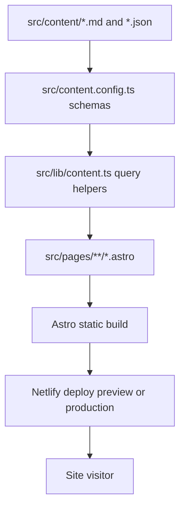

# Sprint 001: CAALR Website Rebuild on Astro + Decap CMS

## Overview

CAALR needs a full website rebuild, not an incremental refresh. The current Weebly/GoDaddy site is dated, expensive for what it delivers, and difficult to evolve into a modern mobile experience. The primary success condition is not developer elegance; it is that a non-technical maintainer can safely update artists, events, gallery images, meeting information, and news through a simple web interface without touching code. That requirement drives the architecture more than any other consideration.

This sprint should build a fully static, low-cost site using Astro and TypeScript, deployed on Netlify’s free tier, with Decap CMS mounted at `/admin`. Astro is a strong fit because it produces fast static output, supports content collections with schema validation, and keeps the codebase simple for a content-heavy site. Decap CMS is a practical fit because it provides an editor-facing UI on top of Git-managed content. However, this sprint should explicitly avoid the deprecated Netlify Identity + Git Gateway path and instead use Decap’s GitHub backend with a dedicated CAALR GitHub maintainer account or invited repo collaborators.

The implementation should treat content structure as a first-class deliverable. The site should be designed around well-defined content types, predictable file paths, accessible templates, and an image workflow that works for older editors. The resulting system should let CAALR migrate all current content into a modern information architecture while preserving the group’s green/yellow visual identity, keeping hosting free, and making future updates operationally simple.

## Use Cases

1. **Board member updates an artist profile**: A maintainer opens `/admin`, edits an artist entry, updates a bio, uploads a new artwork image, and republishes without using Git.
2. **CAALR posts a new show**: A board member creates a new event with title, venue, dates, description, featured image, and RSVP/contact details.
3. **Gallery is refreshed after a meeting or exhibition**: The maintainer uploads several new artwork images, adds alt text and captions, and publishes them into the gallery collection.
4. **Meeting information changes**: The board updates recurring meeting location, time, and schedule text from a settings entry instead of editing templates.
5. **Visitors browse artists on mobile**: A phone user scans the artist listing, opens a profile page, views artwork, and taps social/contact links.
6. **Visitors discover upcoming shows**: A user lands on the home page, sees the next event, opens the event page, and gets directions/contact information.
7. **Board publishes recognition or press coverage**: A maintainer adds a news item with an external link, summary, publication date, and optional image.
8. **User reviews a demo before domain cutover**: Stakeholders validate content, layout, accessibility, and editor workflow on a Netlify subdomain before pointing `caalr.com`.

## Architecture

### Technology Choices

- **Framework**: Astro 5.x with TypeScript in static output mode
- **Deployment**: Netlify free tier, GitHub-connected continuous deployment
- **CMS**: Decap CMS 3.x mounted from `public/admin/`
- **Content storage**: Markdown and JSON files in `src/content/`
- **Styling**: Plain CSS with CSS custom properties in `src/styles/`; avoid framework overhead
- **Image handling**: Astro image pipeline for curated local assets plus pre-sized uploads stored in `public/uploads/`
- **Forms**: No contact form in sprint scope
- **Maps/social**: Google Maps embed and outbound Facebook/Instagram links

### Rationale

Astro gives the project a simple static-site architecture with strong content modeling via content collections and Zod schemas. That keeps page generation predictable and typed. Netlify is appropriate for free hosting, preview deploys, and low-friction Git-based deployment. Decap CMS remains viable, but this plan should use the **GitHub backend** rather than Netlify Identity/Git Gateway because Netlify documents Git Gateway as deprecated and tied to deprecated Identity flows. The maintainer workflow should therefore be based on a simple GitHub login with write access to the repository.

### Proposed Information Architecture

- `/` - Home
- `/about/` - Mission, board, meetings, membership/resources
- `/artists/` - Artist index
- `/artists/[slug]/` - Individual artist profile
- `/events/` - Upcoming and past shows/events index
- `/events/[slug]/` - Individual event detail
- `/gallery/` - Gallery grid with filters/lightbox
- `/news/` - News and achievements index
- `/news/[slug]/` - Individual news item

### Component Responsibilities

- `src/layouts/BaseLayout.astro`
  Common document shell, metadata, global header/footer, skip links, nav, SEO defaults.
- `src/components/Header.astro`
  Primary navigation, mobile menu, logo/wordmark.
- `src/components/Footer.astro`
  Address, meeting summary, copyright, social links.
- `src/components/Hero.astro`
  Reusable page hero with optional image and CTA.
- `src/components/ArtistCard.astro`
  Artist listing card with portrait/artwork thumbnail and medium.
- `src/components/EventCard.astro`
  Event summary card with dates and venue.
- `src/components/GalleryGrid.astro`
  Responsive masonry-like grid using CSS columns or grid; progressive enhancement for lightbox.
- `src/components/Lightbox.ts`
  Small client-side script for image enlargement and keyboard navigation.
- `src/components/SectionHeading.astro`
  Consistent typographic rhythm and spacing.
- `src/lib/content.ts`
  Query helpers to sort/filter content collections.
- `src/lib/seo.ts`
  Metadata defaults, canonical URL helpers, Open Graph image fallbacks.

### Content Model

Content should live under `src/content/` and be validated by [content.config.ts](/home/ckroese/caalr/src/content.config.ts) once implementation begins.

#### `artists` collection

Folder: `src/content/artists/*.md`

Required fields:

- `name: string`
- `slug: string`
- `mediums: string[]`
- `shortBio: string`
- `fullBio: string`
- `featuredImage: string`
- `galleryImages: string[]`
- `email?: string`
- `phone?: string`
- `website?: string`
- `instagram?: string`
- `facebook?: string`
- `isBoardMember: boolean`
- `boardRole?: string`
- `sortOrder: number`
- `status: 'active' | 'alumni'`

Example frontmatter:

```md
---
name: "Jane Doe"
slug: "jane-doe"
mediums:
  - "Oil"
  - "Mixed Media"
shortBio: "Lakewood Ranch painter focused on Florida landscapes."
fullBio: "Longer bio used on the artist detail page."
featuredImage: "/uploads/artists/jane-doe/portrait.jpg"
galleryImages:
  - "/uploads/artists/jane-doe/work-01.jpg"
  - "/uploads/artists/jane-doe/work-02.jpg"
email: "jane@example.com"
website: "https://janedoeart.com"
instagram: "https://instagram.com/janedoeart"
isBoardMember: false
sortOrder: 10
status: "active"
---
```

#### `events` collection

Folder: `src/content/events/*.md`

Required fields:

- `title: string`
- `slug: string`
- `startDate: date`
- `endDate?: date`
- `venueName: string`
- `venueAddress: string`
- `city: string`
- `summary: string`
- `body: string`
- `featuredImage?: string`
- `galleryImages?: string[]`
- `externalLink?: string`
- `status: 'upcoming' | 'past'`
- `featured: boolean`

#### `gallery` collection

Folder: `src/content/gallery/*.md`

Required fields:

- `title: string`
- `slug: string`
- `image: string`
- `alt: string`
- `caption?: string`
- `artist: reference('artists') | string`
- `medium?: string`
- `year?: string`
- `tags: string[]`
- `featured: boolean`
- `sortDate: date`

This collection should support both artist-linked work and general event/gallery photos.

#### `news` collection

Folder: `src/content/news/*.md`

Required fields:

- `title: string`
- `slug: string`
- `date: date`
- `summary: string`
- `body: string`
- `sourceName?: string`
- `sourceUrl?: string`
- `featuredImage?: string`
- `featured: boolean`

#### `pages` collection

Folder: `src/content/pages/`

Entries:

- `home.md`
- `about.md`

`home.md` fields:

- `heroTitle`
- `heroText`
- `heroImage`
- `introText`
- `featuredArtistIds: string[]`
- `featuredEventIds: string[]`

`about.md` fields:

- `missionTitle`
- `missionBody`
- `membershipBody`
- `resources: { label: string; url: string }[]`

#### `settings` collection

Folder: `src/content/settings/`

Files:

- `site.json`
- `board.json`
- `meetings.json`
- `social.json`

`site.json`:

```json
{
  "siteName": "Creative Arts Association of Lakewood Ranch",
  "siteUrl": "https://caalr.com",
  "tagline": "Local artists sharing and growing together",
  "contactEmail": "info@caalr.com",
  "footerText": "CAALR supports artists in the Lakewood Ranch community."
}
```

`board.json` should contain an ordered array of board members with `name`, `role`, `email`, `phone?`, and `artistSlug?`.

`meetings.json` should contain `scheduleSummary`, `locationName`, `locationAddress`, `mapEmbedUrl`, `notes`, and optional seasonal exceptions.

`social.json` should contain `facebookUrl`, `instagramUrl`, and optional `newsletterUrl`.

### Decap CMS Schema

CMS config should live at [public/admin/config.yml](/home/ckroese/caalr/public/admin/config.yml) with these top-level collections:

- `artists` as a folder collection at `src/content/artists`
- `events` as a folder collection at `src/content/events`
- `gallery` as a folder collection at `src/content/gallery`
- `news` as a folder collection at `src/content/news`
- `pages` as a files collection for `home.md` and `about.md`
- `settings` as a files collection for `site.json`, `board.json`, `meetings.json`, and `social.json`

Representative `artists` schema:

```yaml
collections:
  - name: "artists"
    label: "Artists"
    folder: "src/content/artists"
    create: true
    slug: "{{slug}}"
    identifier_field: "name"
    format: "frontmatter"
    fields:
      - { label: "Name", name: "name", widget: "string" }
      - { label: "Slug", name: "slug", widget: "string", hint: "Use lowercase words separated by hyphens." }
      - { label: "Mediums", name: "mediums", widget: "list", field: { label: "Medium", name: "medium", widget: "string" } }
      - { label: "Short Bio", name: "shortBio", widget: "text" }
      - { label: "Full Bio", name: "fullBio", widget: "markdown" }
      - { label: "Featured Image", name: "featuredImage", widget: "image" }
      - { label: "Gallery Images", name: "galleryImages", widget: "list", field: { label: "Image", name: "image", widget: "image" } }
      - { label: "Email", name: "email", widget: "string", required: false }
      - { label: "Website", name: "website", widget: "string", required: false }
      - { label: "Instagram", name: "instagram", widget: "string", required: false }
      - { label: "Facebook", name: "facebook", widget: "string", required: false }
      - { label: "Board Member", name: "isBoardMember", widget: "boolean", default: false }
      - { label: "Board Role", name: "boardRole", widget: "string", required: false }
      - { label: "Sort Order", name: "sortOrder", widget: "number", value_type: "int", default: 100 }
      - { label: "Status", name: "status", widget: "select", options: ["active", "alumni"], default: "active" }
```

Media config should use:

```yaml
media_folder: "public/uploads"
public_folder: "/uploads"
backend:
  name: "github"
  repo: "OWNER/caalr"
  branch: "main"
```

### Data Flow

```text
Editor -> /admin (Decap CMS)
      -> GitHub repo content update
      -> Netlify build webhook / auto deploy
      -> Astro build reads src/content/*
      -> Static HTML/CSS/JS generated in dist/
      -> Visitor requests pages from Netlify CDN
```

### Render Flow



## Implementation

### Phase 1: Foundation and Project Bootstrap (~20% of effort)

**Files:**

- `package.json` - Project scripts and dependencies
- `astro.config.mjs` - Astro configuration
- `tsconfig.json` - TypeScript settings
- `netlify.toml` - Netlify build configuration
- `.gitignore` - Ignore generated assets and env files
- `public/favicon.svg` - Initial favicon/logo asset
- `src/env.d.ts` - Astro type declarations

**Tasks:**

- [ ] Initialize Astro project in static mode with TypeScript.
- [ ] Add dependencies: `astro`, `typescript`, `sharp`, `zod`, `decap-cms-app`.
- [ ] Configure Netlify build command (`astro build`) and publish directory (`dist`).
- [ ] Set canonical production URL and preview-safe environment variable support.
- [ ] Establish baseline CSS variables for CAALR’s green/yellow palette, typography, spacing, and breakpoints.
- [ ] Create base lint/format scripts if desired, but do not bloat the project with unnecessary tooling.

### Phase 2: Content Architecture and CMS Setup (~25% of effort)

**Files:**

- `src/content.config.ts` - Astro content collection schemas
- `src/content/artists/.gitkeep` - Placeholder for artist entries
- `src/content/events/.gitkeep` - Placeholder for event entries
- `src/content/gallery/.gitkeep` - Placeholder for gallery entries
- `src/content/news/.gitkeep` - Placeholder for news entries
- `src/content/pages/home.md` - Home page editable content
- `src/content/pages/about.md` - About page editable content
- `src/content/settings/site.json` - Site metadata
- `src/content/settings/board.json` - Board data
- `src/content/settings/meetings.json` - Meeting data
- `src/content/settings/social.json` - Social links
- `public/admin/index.html` - CMS mount page
- `public/admin/config.yml` - Decap CMS configuration

**Tasks:**

- [ ] Define Zod schemas for all collections and enforce required fields.
- [ ] Configure Decap CMS collections to match Astro schemas exactly.
- [ ] Add editorial hints to fields for older non-technical users.
- [ ] Configure media uploads to `public/uploads`.
- [ ] Choose GitHub backend auth and document account setup in sprint notes.
- [ ] Seed the content folders with initial entries and empty-state-safe defaults.

### Phase 3: Site Shell, Navigation, and Shared UI (~15% of effort)

**Files:**

- `src/layouts/BaseLayout.astro`
- `src/components/Header.astro`
- `src/components/Footer.astro`
- `src/components/Hero.astro`
- `src/components/SectionHeading.astro`
- `src/styles/global.css`
- `src/styles/tokens.css`
- `src/styles/components.css`

**Tasks:**

- [ ] Build accessible header, footer, and skip navigation.
- [ ] Implement responsive navigation with large tap targets and simple labeling.
- [ ] Add reusable layout primitives and heading treatment.
- [ ] Implement SEO defaults, Open Graph tags, and social metadata hooks.
- [ ] Preserve CAALR’s green/yellow palette while modernizing contrast and spacing.

### Phase 4: Page Templates and Content Rendering (~20% of effort)

**Files:**

- `src/lib/content.ts`
- `src/lib/seo.ts`
- `src/pages/index.astro`
- `src/pages/about.astro`
- `src/pages/artists/index.astro`
- `src/pages/artists/[slug].astro`
- `src/pages/events/index.astro`
- `src/pages/events/[slug].astro`
- `src/pages/gallery.astro`
- `src/pages/news/index.astro`
- `src/pages/news/[slug].astro`
- `src/components/ArtistCard.astro`
- `src/components/EventCard.astro`
- `src/components/GalleryGrid.astro`

**Tasks:**

- [ ] Build all public page routes from collection data.
- [ ] Implement sorting and filtering helpers for active artists, featured content, and upcoming events.
- [ ] Surface board members and meeting details on the About page from settings files.
- [ ] Add graceful fallbacks for missing optional images or external links.
- [ ] Ensure all templates are accessible and readable at older-user-friendly sizes.

### Phase 5: Gallery, Image Optimization, and Content Migration (~10% of effort)

**Files:**

- `public/uploads/**` - Uploaded CMS assets
- `src/scripts/` - Optional migration helper scripts if needed
- `docs/content-migration-checklist.md`

**Tasks:**

- [ ] Implement lightbox behavior with keyboard support and no-JS fallback.
- [ ] Define image sizing standards for portrait, card, hero, and gallery contexts.
- [ ] Migrate all existing CAALR content from the live Weebly site into structured content files.
- [ ] Normalize filenames and alt text for accessibility and maintainability.
- [ ] Record any missing source assets, low-resolution images, or uncertain artist bios.

### Phase 6: QA, CMS Training Materials, and Launch Preparation (~10% of effort)

**Files:**

- `README.md`
- `docs/maintainer-guide.md`
- `docs/launch-checklist.md`
- `docs/qa-checklist.md`

**Tasks:**

- [ ] Document local setup, deployment, and content editing workflow.
- [ ] Write a maintainer guide with screenshots and explicit publish steps.
- [ ] Run Lighthouse, keyboard, contrast, and responsive QA passes.
- [ ] Validate CMS usability by performing real create/edit/delete flows.
- [ ] Prepare domain cutover checklist from Netlify subdomain to `caalr.com`.

## Files Summary

| File | Action | Purpose |
|------|--------|---------|
| `package.json` | Create | Define Astro project dependencies and scripts |
| `astro.config.mjs` | Create | Configure Astro static build and site metadata |
| `netlify.toml` | Create | Configure Netlify build/publish settings |
| `tsconfig.json` | Create | TypeScript configuration |
| `src/content.config.ts` | Create | Define all content collection schemas |
| `src/content/artists/*.md` | Create | Artist profile entries |
| `src/content/events/*.md` | Create | Event/show entries |
| `src/content/gallery/*.md` | Create | Gallery image metadata entries |
| `src/content/news/*.md` | Create | News/highlight entries |
| `src/content/pages/home.md` | Create | Editable home page content |
| `src/content/pages/about.md` | Create | Editable about/resources content |
| `src/content/settings/site.json` | Create | Site metadata and footer content |
| `src/content/settings/board.json` | Create | Board of directors data |
| `src/content/settings/meetings.json` | Create | Meeting schedule/location data |
| `src/content/settings/social.json` | Create | Social media links |
| `public/admin/index.html` | Create | Decap CMS entry page |
| `public/admin/config.yml` | Create | CMS collections and media configuration |
| `src/layouts/BaseLayout.astro` | Create | Global site shell |
| `src/components/Header.astro` | Create | Top navigation |
| `src/components/Footer.astro` | Create | Footer with social/meeting info |
| `src/components/Hero.astro` | Create | Shared hero component |
| `src/components/ArtistCard.astro` | Create | Artist list UI |
| `src/components/EventCard.astro` | Create | Event list UI |
| `src/components/GalleryGrid.astro` | Create | Gallery rendering and lightbox hooks |
| `src/lib/content.ts` | Create | Collection query helpers |
| `src/lib/seo.ts` | Create | Metadata helper functions |
| `src/pages/index.astro` | Create | Home route |
| `src/pages/about.astro` | Create | About route |
| `src/pages/artists/index.astro` | Create | Artists index |
| `src/pages/artists/[slug].astro` | Create | Artist detail page |
| `src/pages/events/index.astro` | Create | Events index |
| `src/pages/events/[slug].astro` | Create | Event detail page |
| `src/pages/gallery.astro` | Create | Gallery page |
| `src/pages/news/index.astro` | Create | News index |
| `src/pages/news/[slug].astro` | Create | News detail page |
| `src/styles/global.css` | Create | Global reset/base styles |
| `src/styles/tokens.css` | Create | Design tokens and color system |
| `docs/maintainer-guide.md` | Create | Step-by-step CMS guide for editors |
| `docs/content-migration-checklist.md` | Create | Track migration completeness |
| `docs/launch-checklist.md` | Create | Cutover and post-launch steps |
| `README.md` | Create | Project setup and architecture summary |

## Definition of Done

- [ ] Astro project builds successfully as a static site on Netlify.
- [ ] Netlify preview deployment is available on a free subdomain.
- [ ] Decap CMS is accessible at `/admin` and can authenticate via GitHub backend.
- [ ] All core content collections are implemented with matching Astro and CMS schemas.
- [ ] All current CAALR site pages and content areas are represented in the new IA.
- [ ] Each active artist has an individual profile page with biography and at least one image.
- [ ] Events, gallery, news, board info, meetings, and social links are editable through CMS.
- [ ] Home, About, Artists, Events, Gallery, and News templates are responsive and accessible.
- [ ] Gallery lightbox works with keyboard navigation and has a no-JS fallback.
- [ ] All uploaded images have useful alt text and consistent file naming.
- [ ] Lighthouse accessibility score is 90+ on representative pages.
- [ ] Lighthouse performance score is 90+ on representative pages.
- [ ] Keyboard-only navigation works across site header, content, gallery, and footer.
- [ ] Maintainer guide is complete enough for a non-technical editor to publish an artist update and a new event.
- [ ] Demo review is completed before custom domain cutover.

## Risks & Mitigations

| Risk | Likelihood | Impact | Mitigation |
|------|------------|--------|------------|
| Decap auth path becomes confusing for non-technical editors | Medium | High | Use GitHub backend with a dedicated CAALR editor account, document login steps with screenshots, and avoid deprecated Netlify Identity/Git Gateway setup |
| Content migration from Weebly is manual and time-consuming | High | High | Create a migration checklist, batch content by section, and mark placeholders for missing bios/images instead of blocking launch |
| Existing images are low resolution or inconsistently cropped | High | Medium | Define minimum asset standards, preserve originals, and create fallback card styles that tolerate mixed dimensions |
| Gallery uploads bloat repository size over time | Medium | Medium | Resize images before upload, establish upload guidance in maintainer docs, and periodically archive oversized unused assets |
| Older maintainers struggle with CMS terminology | Medium | High | Rename CMS labels in plain language, add field hints, minimize optional fields, and provide screenshots |
| Accessibility regressions slip in during visual design work | Medium | High | Bake accessibility checks into every template phase and test with keyboard and screen-reader basics before content freeze |
| Domain cutover introduces DNS downtime | Low | Medium | Launch on Netlify preview first, document exact DNS changes, and perform cutover during a low-risk window |

## Security Considerations

- Use the Decap CMS GitHub backend instead of deprecated Netlify Identity/Git Gateway.
- Limit GitHub repository write access to the smallest possible set of CAALR maintainers.
- Use a dedicated CAALR organization or service account rather than a personal account owned by one volunteer.
- Store no sensitive personal data beyond public-facing contact details explicitly approved for publication.
- Keep Netlify environment variables limited to non-secret site config; avoid storing unnecessary secrets.
- Add basic security headers in Netlify configuration, including `X-Frame-Options`, `Referrer-Policy`, and a conservative Content Security Policy if compatible with embeds.
- Review embedded third-party content, especially Google Maps, for privacy and CSP implications.
- Document account recovery steps so the site is not operationally dependent on one maintainer.

## Dependencies

- GitHub repository for source control and CMS backend access
- Netlify site connected to the GitHub repository
- Astro 5.x and its content collections support
- Decap CMS 3.x loaded from `public/admin/`
- `sharp` for Astro image processing
- Existing CAALR site content and assets from `https://caalr.com/`
- Final decision on who owns the CAALR GitHub and Netlify accounts
- Access to Facebook and Instagram URLs currently used by CAALR
- Confirmation of approved public contact information for board members and artists

## Open Questions

1. Should the repository live under a dedicated CAALR GitHub organization, or under an individual volunteer account initially?
2. Does CAALR want all board member email addresses public, or only a general contact email?
3. Is the current site map best preserved as separate News and Resources content, or should resources remain folded into About for a simpler navigation model?
4. How much manual cleanup should happen for artist bios and artwork before first launch versus a later refinement sprint?
5. Should the gallery support filtering by artist and medium in Sprint 001, or is a simple chronological grid sufficient for first launch?
6. Does CAALR have a usable source logo file, or should the sprint include a temporary wordmark/logo recreation task?
7. Are there recurring meeting exceptions or seasonal schedules that require a richer meeting data model than a single summary block?
